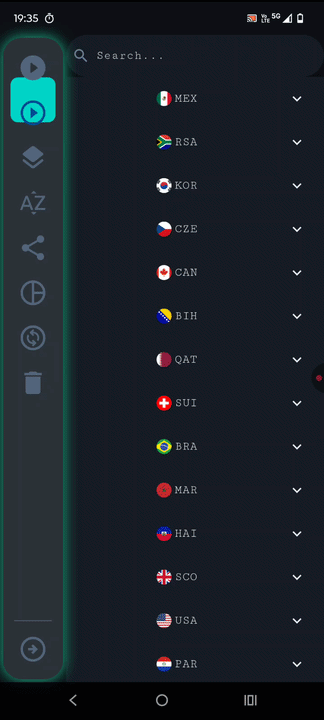

<h1>World Cup 2026 Sticker Album</h1>

An open-source Flutter application inspired by the <strong>Figuritas</strong> app, created to help collectors organize and track their <strong>FIFA World Cup 2026</strong> sticker collections.

The goal of this project is to provide a free, modern, and transparent alternative for managing sticker albums while serving as a learning project for Flutter development.

<h2>Getting Started</h2>

To run this project locally, make sure you have the Flutter SDK installed.

<h3>Requirements</h3>

<ul>
  <li>Flutter SDK (latest stable version)</li>
  <li>Dart SDK (included with Flutter)</li>
  <li>Android Studio, VS Code, or another Flutter-compatible IDE</li>
  <li>An emulator or a physical device</li>
</ul>

<h3>Installation</h3>

<pre><code>git clone https://github.com/your-username/world-cup-2026-sticker-album.git
cd world-cup-2026-sticker-album
flutter pub get
flutter run
</code></pre>

If multiple devices are available, you can specify one using:

<pre><code>flutter devices
flutter run -d &lt;device-id&gt;
</code></pre>

<h2>Features</h2>

<ul>
  <li>Track collected and missing stickers</li>
  <li>View album completion statistics</li>
  <li>Organize stickers by country/team</li>
  <li>Quickly search for specific stickers</li>
  <li>Clean and intuitive Material Design interface</li>
  <li>Cross-platform support (Android, iOS, Windows, macOS, Linux, and Web)</li>
</ul>

<h2>Project Goals</h2>

<ul>
  <li>Build a complete Flutter application following clean architecture principles.</li>
  <li>Provide an open-source alternative for World Cup sticker collectors.</li>
  <li>Practice Flutter, state management, local persistence, and responsive UI design.</li>
  <li>Encourage community contributions and improvements.</li>
</ul>

<h2>Disclaimer</h2>

This project is <strong>not affiliated with, endorsed by, or associated with Panini, FIFA, or the Figuritas application</strong>. It is an independent, fan-made, open-source project created for educational and personal use.

<h2>Contributing</h2>

Contributions are welcome! Feel free to open an issue, suggest new features, or submit a pull request.

<h2>License</h2>

This project is licensed under the MIT License. See the <code>LICENSE</code> file for more information.

